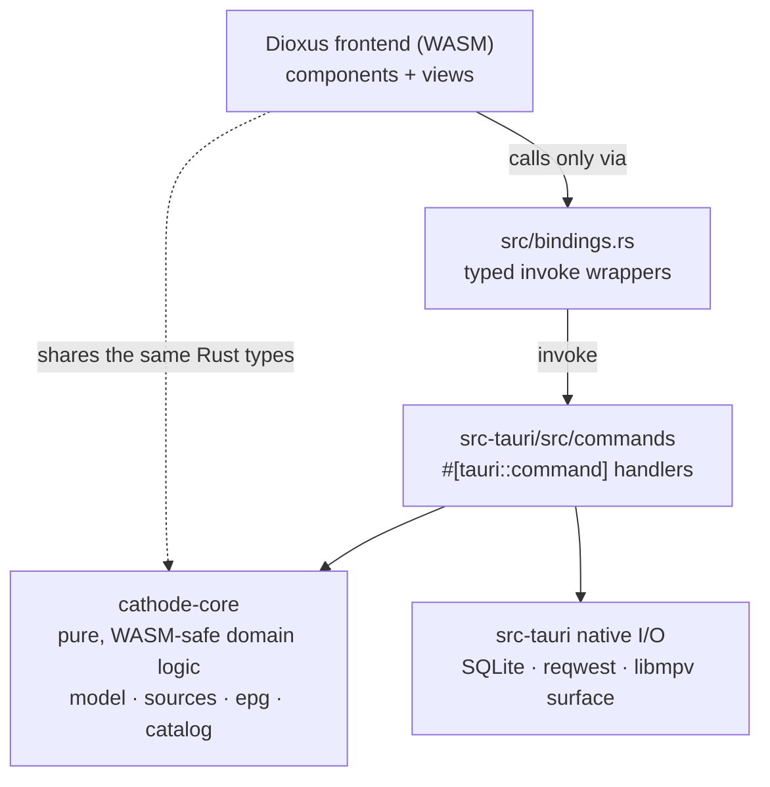

# Cathode

Cathode is a desktop IPTV player. Point it at an [Xtream Codes](https://en.wikipedia.org/wiki/Xtream_Codes) account and it pulls in your live channels, movies, and series, shows a programme guide, and plays streams with [mpv](https://mpv.io).

[](https://github.com/kaiserbh/cathode/actions/workflows/ci.yml)
[](https://github.com/kaiserbh/cathode/releases)
[](./LICENSE)

It's written entirely in Rust:

- A [Tauri](https://tauri.app) v2 shell holds the window, app state, the SQLite cache, the HTTP client, and the mpv video surface.
- A [Dioxus](https://dioxuslabs.com) 0.7 frontend (Rust compiled to WebAssembly) renders the UI in the webview.
- A `cathode-core` crate holds the domain model and all the parsing and normalization. It stays WASM-safe so both the shell and the frontend can depend on it.
- Playback links libmpv directly and drives it through mpv's render API, with no spawned processes and no `--wid` embedding.

Because it's Rust on both sides, the same `Stream`, `Category`, and `Programme` types go straight from the backend into the UI. There's no serialization boundary and no duplicated model definitions.

## Platform support

Windows x64, macOS (Apple Silicon), and Linux (Wayland and X11).

| Platform | Notes |
| --- | --- |
| Windows x64 | libmpv and ANGLE are vendored in the repo (Git LFS), so there's no extra setup. |
| macOS (Apple Silicon) | Needs `brew install mpv` for now; bundling libmpv into the `.app` is on the roadmap. Intel Macs aren't shipped as binaries (GitHub retired the Intel runner); build from source. |
| Linux (Wayland / X11) | Released as an **AppImage** and a **.deb**, both built against the distro's libmpv. The AppImage targets recent distributions (glibc 2.39+, e.g. Ubuntu 24.04 / current rolling releases). Arch users build from source (see [Install](#install)). |

The released binaries aren't code-signed yet, so macOS warns through Gatekeeper and Windows through SmartScreen. The [install](#install) section explains how to get past that.

## Features

- Sources: Xtream Codes accounts (live TV, movies, and series with seasons and episodes) and plain M3U/M3U8 playlists (loaded by URL or local file, no account required — every entry is a live channel grouped by `group-title`). You can save several sources of either kind (with a recently-used list), and there's an incognito mode that doesn't keep history.
- Programme guide (EPG): an XMLTV parser feeds a now/next view and a scrollable timeline, cached in SQLite. Xtream uses the account's `xmltv.php`; M3U playlists pull the (optionally gzipped) XMLTV URLs declared in their `#EXTM3U` header — auto-detected into an editable field and trimmed to the channels the playlist carries. The guide grid is virtualized, and clicking a programme opens a detail popover.
- Playback through libmpv's render API: play, pause, resume, stop, volume, mute, fullscreen, and hardware decoding (`hwdec=auto-safe`). Video draws on a native GL surface behind the transparent webview (an `NSOpenGLView` on macOS, an ANGLE EGL/Direct3D 11 surface on Windows, a `GtkGLArea` on Linux), with a small playback HUD.
- Local catalog: SQLite caches categories, streams, and programmes. Favorites and watch history use stable IDs (an xxhash3 of the source plus the provider's own id) so they survive a re-sync and don't break when a provider reorders its list.
- UI built with Dioxus, the [dioxus-primitives](https://github.com/DioxusLabs/components) components, and [Lucide](https://lucide.dev) icons: tabs for Live, Movies, Series, Favorites, and History, plus search, series drill-down, a settings panel, and a logs panel whose level you can change at runtime.

## How it works



`cathode-core` is pure and deterministic. Parsing, normalization, stable-id derivation, EPG matching, and Xtream URL building all live there, with no global state and no hidden I/O, so its tests run in milliseconds and the crate keeps compiling to `wasm32-unknown-unknown`. Network and disk access are passed in behind traits.

There's one normalized model. Every source produces the same `Stream`, `Category`, and `Programme`, and the UI uses those types directly, so nothing downstream cares which source a record came from. The shell stays thin: the `#[tauri::command]` handlers in `src-tauri/src/commands/` validate input, call into the core, and own the native parts (SQLite via rusqlite, HTTP via reqwest, the mpv surface). The UI only ever reaches the backend through the typed wrappers in [`src/bindings.rs`](./src/bindings.rs), never a raw `invoke`.

## Install

Download the latest build from the [releases page](https://github.com/kaiserbh/cathode/releases).

- Windows: run the `.msi` (or the NSIS `.exe`). If SmartScreen warns, choose "More info", then "Run anyway".
- macOS (Apple Silicon): install mpv first with `brew install mpv`, then open the `.dmg`. If Gatekeeper blocks it on first launch, right-click the app and choose Open, or run `xattr -dr com.apple.quarantine /Applications/Cathode.app`. Intel Macs aren't published as binaries; build from source.
- Linux: download the `.AppImage` (`chmod +x` it and run), or the `.deb` (`sudo apt install ./Cathode_*.deb`). Both need the system libmpv at runtime; on Debian/Ubuntu the `.deb` pulls it in, and for the AppImage install `mpv` (or `libmpv2`) yourself. The AppImage targets recent distributions (glibc 2.39+).

### Arch Linux

Arch isn't covered by the release binaries, so Cathode is built from source. The package is on the AUR; install it with an AUR helper, which resolves the build dependencies (including `tauri-cli`) for you:

```sh
paru -S cathode   # or: yay -S cathode
```

No AUR helper? The one-liner installs the dependencies, builds, and installs Cathode plus a launcher entry:

```sh
curl -fsSL https://raw.githubusercontent.com/kaiserbh/cathode/main/scripts/install-arch.sh | sh
```

Or build the checked-in [PKGBUILD](./packaging/arch/PKGBUILD) directly with `makepkg` (no AUR helper needed; it builds its own pinned `tauri-cli`):

```sh
git clone https://github.com/kaiserbh/cathode
cd cathode/packaging/arch
makepkg -si
```

Either way the runtime dependencies are `mpv` (provides libmpv), `gtk3`, and `webkit2gtk-4.1`.

## Building from source

You'll need:

- Rust 1.85 or newer. The toolchain is pinned in [`rust-toolchain.toml`](./rust-toolchain.toml), so rustup installs the right version and the `wasm32-unknown-unknown` target for you.
- The Dioxus CLI: `cargo install dioxus-cli@0.7.9` (or `cargo binstall dioxus-cli@0.7.9`).
- Git LFS, for the vendored Windows libmpv DLLs.

### libmpv per platform

Cathode links libmpv directly through the `libmpv2` crate. `libmpv2-sys` emits `-lmpv` without a search path, so each platform has to point the linker at its own libmpv; `src-tauri/build.rs` does this per OS.

On macOS:

```sh
brew install mpv
```

`libmpv2-sys` finds it through pkg-config, and the build script adds the Homebrew lib directory to the linker search path. That's all you need.

On Windows (x64), libmpv and ANGLE are vendored under `src-tauri/vendor/mpv/windows-x64/`: the 112 MB `libmpv-2.dll` through Git LFS, a generated `mpv.lib` import library, and ANGLE's `libEGL.dll` and `libGLESv2.dll`. So the only thing you need is Git LFS:

```sh
git lfs install   # once per machine
git clone https://github.com/kaiserbh/cathode
# already cloned without LFS? run: git lfs pull
```

`build.rs` points the linker at the vendored `mpv.lib` and copies the runtime DLLs next to the built binaries. If you see `LINK : fatal error LNK1181: cannot open input file 'mpv.lib'`, the LFS files weren't fetched, so run `git lfs pull`.

On Linux, install the system libraries before building (nothing is vendored): libmpv, GTK 3, and WebKitGTK, plus their `-dev` packages. On Arch: `sudo pacman -S mpv gtk3 webkit2gtk-4.1`. On Debian/Ubuntu: `sudo apt install libmpv-dev libgtk-3-dev libwebkit2gtk-4.1-dev librsvg2-dev`. The build links `libmpv.so.2` (mpv 0.37 or newer), so on older releases that still ship mpv 0.34 you'll need a newer libmpv. The GL entry points are resolved at runtime through `libEGL`/`libGL` (shipped with Mesa), so there's no libepoxy dependency.

### Common commands

| Action | Command |
| --- | --- |
| Run the app (dev) | `cargo tauri dev` |
| Build release bundles | `cargo tauri build` |
| Frontend hot-reload (UI only) | `dx serve` |
| Build the frontend to WASM | `dx build` |
| Format / lint / test | `cargo fmt --all -- --check`, `cargo clippy --all-targets --all-features -- -D warnings`, `cargo test --all` |

## Roadmap

Roughly in order of priority. Contributions to any of these are welcome.

- Bundle libmpv into the macOS `.app` so `brew install mpv` is no longer required.
- Code signing and notarization (Apple notarization, Windows Authenticode) so releases launch without warnings.
- Quality-of-life work: better search and filtering, keyboard shortcuts, resume-from-position, a configurable default volume and `hwdec`, and theming.
- More EPG: catch-up/archive, reminders, and channel logos.
- Maybe later: an in-app updater, Windows ARM64, a Linux Flatpak, and an AUR package.

## Contributing

Pull requests are welcome. A few things worth knowing:

- A handful of rules keep the codebase tidy: write the test first, put new domain logic in `cathode-core` (and keep it WASM-safe, so no native-only dependencies), and have the UI reach the backend only through `src/bindings.rs`.
- The project uses [Conventional Commits](https://www.conventionalcommits.org/) (`feat:`, `fix:`, `feat(epg): ...`). Releases are automated with release-please, and a PR's title becomes the squash commit that decides the next version, so keep the title conventional.
- Before opening a PR, check that `cargo fmt --all -- --check`, `cargo clippy --all-targets --all-features -- -D warnings`, and `cargo test --all` pass, plus `dx build` if you changed the frontend.

### Releasing

Releases come straight from the commit history:

1. When commits land on `main`, release-please opens (and keeps updating) a "chore: release X.Y.Z" PR that bumps the version everywhere and updates `CHANGELOG.md`.
2. Merging that PR tags `vX.Y.Z` and publishes a GitHub release, which kicks off [`release-build.yml`](./.github/workflows/release-build.yml) to build and upload the macOS, Windows, and Linux (AppImage + `.deb`) bundles, and [`aur-publish.yml`](./.github/workflows/aur-publish.yml) to push the bumped [PKGBUILD](./packaging/arch/PKGBUILD) to the AUR. The PKGBUILD's `pkgver` is part of the release-please bump (see `release-please-config.json`), so the AUR always tracks the latest release.

This needs three one-time repo secrets: `APP_ID` and `APP_PRIVATE_KEY` for a GitHub App with `contents:write` and `pull_requests:write` (a release created by the default `GITHUB_TOKEN` won't trigger the build workflows, which is why the App is needed), plus `AUR_SSH_PRIVATE_KEY` (an SSH key whose public half is registered on the AUR account) for the AUR push.

## License

[GPL-3.0-or-later](./LICENSE). Cathode links libmpv and ships it on Windows, so GPL-3.0 keeps the distributed binaries license-compatible.

## Acknowledgements

Built on mpv/libmpv, Tauri, Dioxus, dioxus-primitives, and Lucide.
